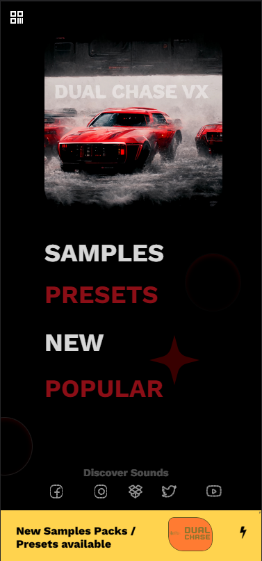

# VX-DUAL-CHASE-X

**Dual Chase** is a cutting-edge mobile app designed for music producers and enthusiasts who want to take their creativity to the next level. With its innovative Sample Pack App, you have access to a huge range of virtual instruments, samples, and plugins right at your fingertips.

---

## ✨ Features

- **Extensive Sample Library**: Access thousands of high-quality samples across multiple genres.
- **Virtual Instruments**: Play and customize a wide range of instruments directly within the app.
- **Built-In Plugins**: Enhance your tracks with professional-grade audio effects.
- **Easy Integration**: Export your creations seamlessly to your favorite DAWs.
- **User-Friendly Interface**: Intuitive design tailored for both beginners and seasoned producers.

---

## 🚀 Getting Started

, 

### Prerequisites

Ensure you have:
- A smartphone or tablet running iOS or Android.
- Internet access to download and update sample packs.

---

## 🧑‍💻 Author

**Kasam Ali Aftab**  
Software Engineer & Creator of VX-DUAL-CHASE-X  
[LinkedIn Profile](https://www.linkedin.com/in/kasam-software-engineer/)

Feel free to connect with me for collaboration or feedback!

